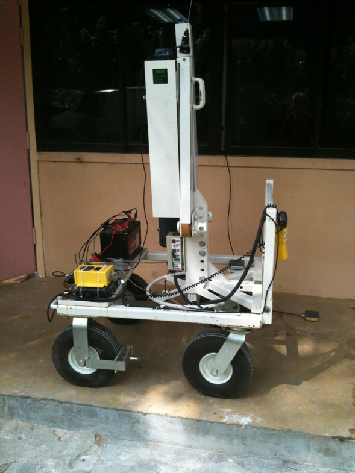
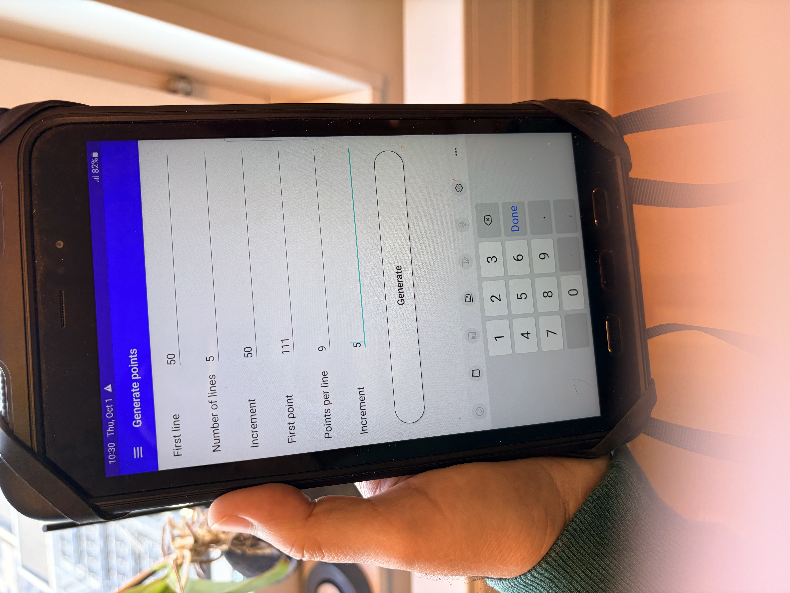
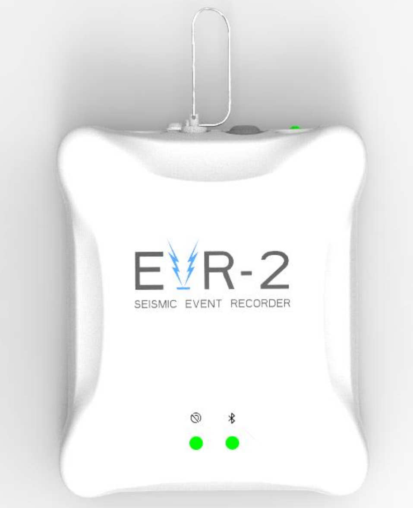
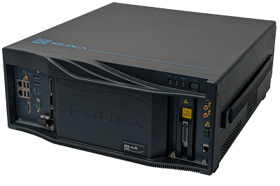

Title: Internal Erosion Risk Assessment: What Geophysics Can See Inside a Dam
Date: 2026-10-02
Summary: How fiber-optic seismic methods support internal erosion risk assessment of embankment dams, from active MASW to ambient noise tomography.
Cover: images/desk.jpeg

Embankment dams are among the most common water-retaining structures in the world, and many have now been in service for half a century or more. Built from compacted soil and rock, they depend on a delicate balance between the water they hold back and the materials that resist it. An embankment is never entirely static. Water seeps through it continuously, pore pressures rise and fall with the reservoir, and the fill slowly consolidates and settles. Over decades, these processes can open paths for internal erosion, the gradual washing out of fine particles by seepage.

Telling normal behavior apart from the early stages of a problem is one of the central tasks of dam surveillance. Sweden has never had a dam failure caused by internal erosion, but sinkholes have been reported at a number of embankment dams over the years, ranging from small pits a few decimeters across to holes of around 30 cubic meters. Experience shows that these problems rarely appear without warning. They build up gradually, and the ability to detect them early is what separates routine maintenance from emergency repair. This article looks at internal erosion risk assessment from a geophysicist's point of view: how the process develops, the signs it leaves, and how fiber-optic seismic methods can feed the assessment with information from inside the embankment, using our current search for a cavity beneath a dam crest as an example.

### How internal erosion develops

Internal erosion risk is usually assessed in four phases. **Initiation** is when seepage first starts to detach particles from the fill or foundation. In **continuation**, those particles keep moving because filters or transition zones cannot hold them back. During **progression**, an erosion pipe or void grows and seepage increases; this is where cavities and sinkholes form. **Breach** is the final phase, when the dam loses its ability to hold back water. Geophysics is most valuable in the continuation and progression phases, when changes inside the embankment are real but not yet visible at the surface.

### Where geophysics fits in the risk assessment

An internal erosion risk assessment asks a sequence of practical questions. Where in the dam could erosion start? If it starts, will the filters stop it? How quickly could it grow, and would we notice in time? Traditional answers come from design records, inspections and point instruments such as piezometers and seepage weirs. These are essential, but they sample the dam at a few locations, and a weak zone between two instruments can go unnoticed.

Geophysics fills that gap. It measures physical properties continuously along and through the embankment, so it can show where conditions differ from the rest of the dam, establish a baseline, and reveal how those conditions change over time. In practice, it helps the assessment in three ways: it points to sections where erosion is more likely to start, it shows whether a suspected defect is stable or growing, and it guides where to drill, instrument or repair.

### What to look for

**1. Increased or turbid seepage.** A sudden rise in leakage, or seepage that turns cloudy, means water has started carrying soil particles with it.

**2. Pore-pressure anomalies.** Piezometer readings that depart from their usual relationship with the reservoir level can point to a new flow path or a filter that is no longer working.

**3. Sinkholes and crest settlement.** A depression on the crest is often the first visible sign that material has been removed from inside the embankment. Incidents are more common where the fill meets concrete structures or rests on an irregular foundation.

**4. Cracking and localized deformation.** Cracks, especially across the crest, can open a direct path for concentrated leaks through the core.

**5. Loss of stiffness inside the embankment.** As fines are washed out, the fill loosens and its shear-wave velocity drops. This happens where no surface instrument can see it, and it is the sign our fiber-optic surveys are designed to detect.

### Upcoming fieldwork

We are now preparing to put this into practice. In the coming fieldwork, we will collect data on an embankment dam in Sweden where a cavity is suspected beneath the crest. The plan is to record active-source MASW shots along the crest on a permanently installed fiber, and to keep the fiber recording ambient noise before, during and after the survey. Together, the two datasets will give both a detailed snapshot of the embankment and a baseline for monitoring how it changes over time. The sections below describe the equipment and workflow we will use.

### Active-source MASW on fiber

Our main tool is multichannel analysis of surface waves (MASW), recorded with distributed acoustic sensing (DAS). A single fiber-optic cable along the crest acts as hundreds of sensors, recording continuously, and because it stays in place the survey can be repeated with the same geometry and compared over time.

The seismic waves come from a GISCO ESS100, an electric accelerated weight drop. Instead of relying on a heavier hammer, it accelerates a 45 kg weight over a longer stroke, and since energy grows with the square of velocity, a compact, battery-powered unit of about 80 kg can deliver energy close to trailer-mounted sources. It needs no engine, hydraulics or fuel on the dam, and one person can move it along the crest.

  
  

To match each hit to the fiber recording, an EVR-2 GPS event recorder is connected to the source trigger. Every shot gets a precise GPS time stamp, a line number and a station number. Each roughly 50-meter section of the dam is treated as its own line, so the shot list follows the structure of the dam itself. The time stamps are then used to cut the shots out of the continuous DAS record.

  
  

Before any cutting happens, the shot logs need some housekeeping. For each OB log in `./data/`, a short script does four things:

* **Reads the log.** The EVR-2 writes one tab-separated row per trigger, with FFID, line, station (Point), UTC date and time, GPS time in microseconds, and latitude/longitude.
* **Builds a proper timestamp for each hit.** It joins the UTC date and time into one timestamp with microsecond precision, and converts it to unix time (seconds since 1970-01-01), which is easy to compare against the DAS file times.
* **Checks the timing.** It converts the GPS-time column to UTC independently, using the 18-second leap-second offset. If the two disagree by more than 1 ms, it prints a warning. This catches a wrong leap-second value or a corrupted log before any data are cut with bad times.
* **Cleans the coordinates.** It converts the EVR-2's degree-minute-second values (DDDMMSS.sss) to decimal degrees. Hits logged without a GPS fix (lat/lon = 0) get the mean position of the valid fixes.

The result is one row per hit, with ffid, line, station, utc, unix, lat and lon, saved to `./output/_shots.csv`.

### Passive ambient noise interferometry

The fiber keeps listening when the source stops. Between shots, and long after the survey crew has gone home, the DAS records ambient noise from wind, flowing water, traffic on the crest and distant machinery. Through ambient noise interferometry, this noise is cross-correlated between channels to create virtual shots, as if a source had been fired at every point along the cable. That gives a second, independent view of the embankment's shear-wave velocity from the same fiber, at no extra field cost.

The same noise can also be used for imaging. In ambient noise tomography, we measure how fast surface waves travel between many pairs of channels at different frequencies, and invert those travel times for a shear-wave velocity model. With a channel every meter or so, the fiber provides a very dense set of measurements and a high-resolution velocity image along the length of the dam. Because the noise never stops, the image can be rebuilt again and again to see whether a suspicious zone is stable or growing.

The two approaches complement each other. Active MASW gives sharp, high-frequency detail in the upper part of the embankment at the time of the survey. Passive methods reach lower frequencies and greater depths, and turn a one-off survey into continuous monitoring.

### Interpreting the results

A cavity, and the loosened material around it, typically appears as a zone of lower shear-wave velocity and disturbed wave patterns. On its own, that is not proof. A low-velocity zone could also be wetter fill or an old repair. For that reason, the seismic results are combined with temperature sensing for seepage, piezometer data, inspection records and targeted drilling where the data point.

### From detection to response

A warning sign is only useful if someone knows what to do about it, and that should be agreed before the sign appears, in the dam's surveillance and emergency plans. Depending on how serious the indication is, typical responses include:

* **Intensified monitoring.** Increase the frequency of readings and inspections in the affected section, and compare the seismic, temperature, seepage and pore-pressure data side by side.
* **Targeted investigation.** Use low-velocity zones and temperature anomalies to place boreholes, probing or new piezometers where they will tell us the most.
* **Reservoir management.** Lower the reservoir level to reduce the hydraulic gradient driving the seepage while the cause is investigated.
* **Controlling the exit.** Place a filter berm or weighted filter where seepage emerges, so water can drain without carrying soil with it.
* **Repairing the defect.** Once the extent of a void or eroded zone is known, repair it by grouting, or by excavating and replacing the affected fill.

### Conclusion

Keeping an embankment dam safe draws on soil mechanics, hydraulics, instrumentation and geophysics at the same time. Increased seepage, pore-pressure anomalies, crest settlement, cracking and loss of stiffness often show up together, because they are different views of the same process: water slowly rearranging the inside of the dam. Seepage and pore pressure show how water moves, surface surveys show where the dam deforms, and fiber-optic seismic methods reveal what happens inside the embankment between the instruments. Problems tend to develop where there are already signs of them: a wet patch on the slope, a slight dip on the crest, a section repaired decades ago. With DAS, active MASW and ambient noise interferometry, we can look beneath those places, track how they change, and act early. With fiber in the ground, we can find cavities before they find us.

