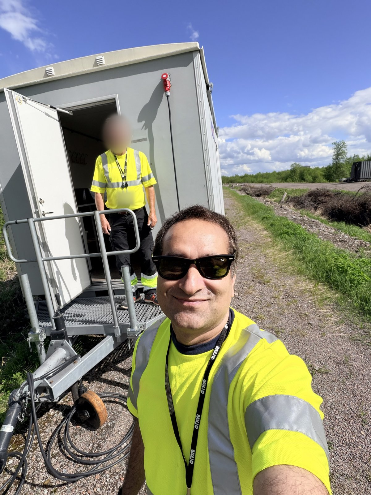
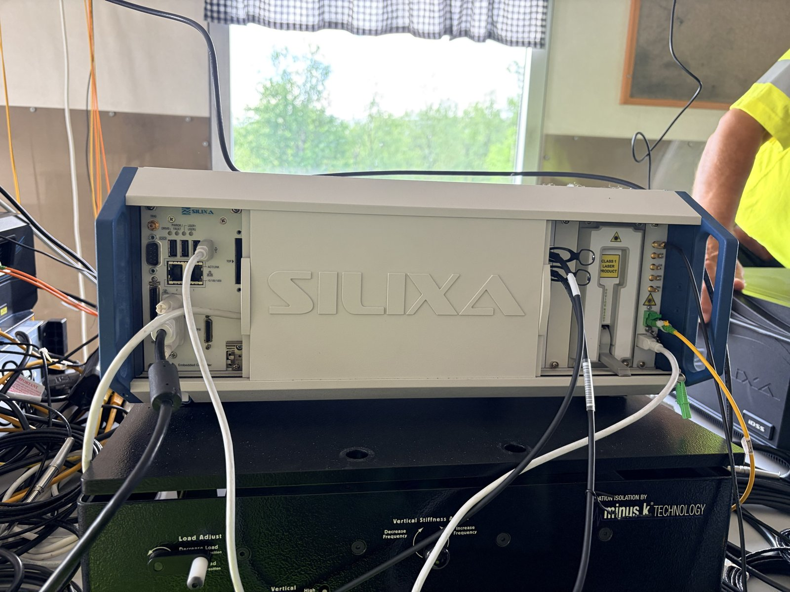
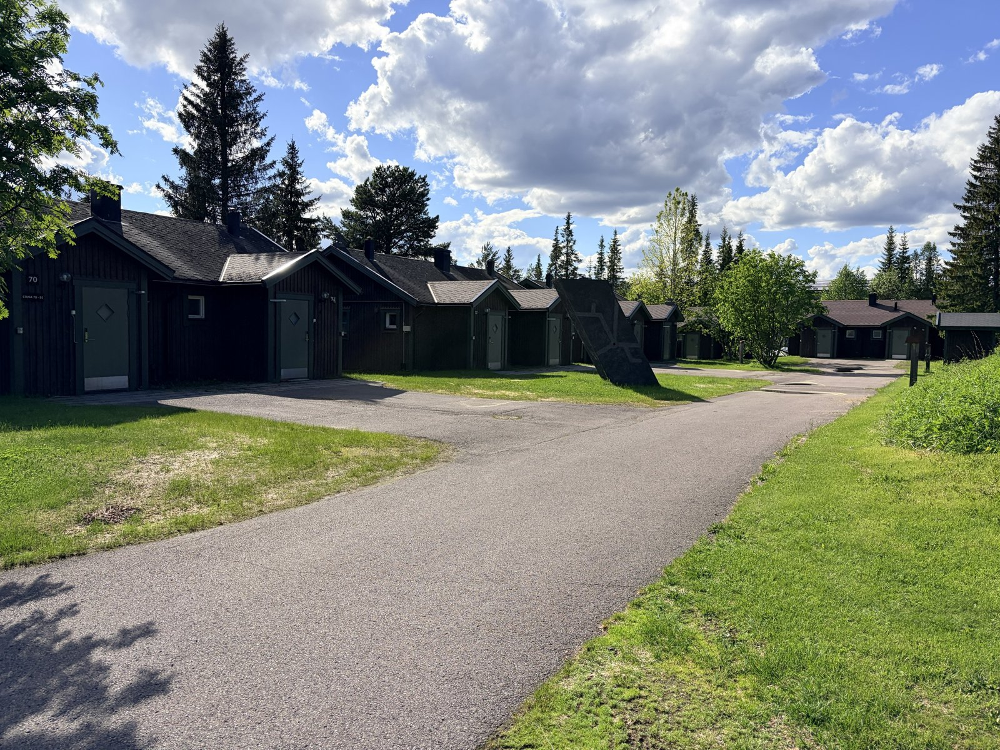
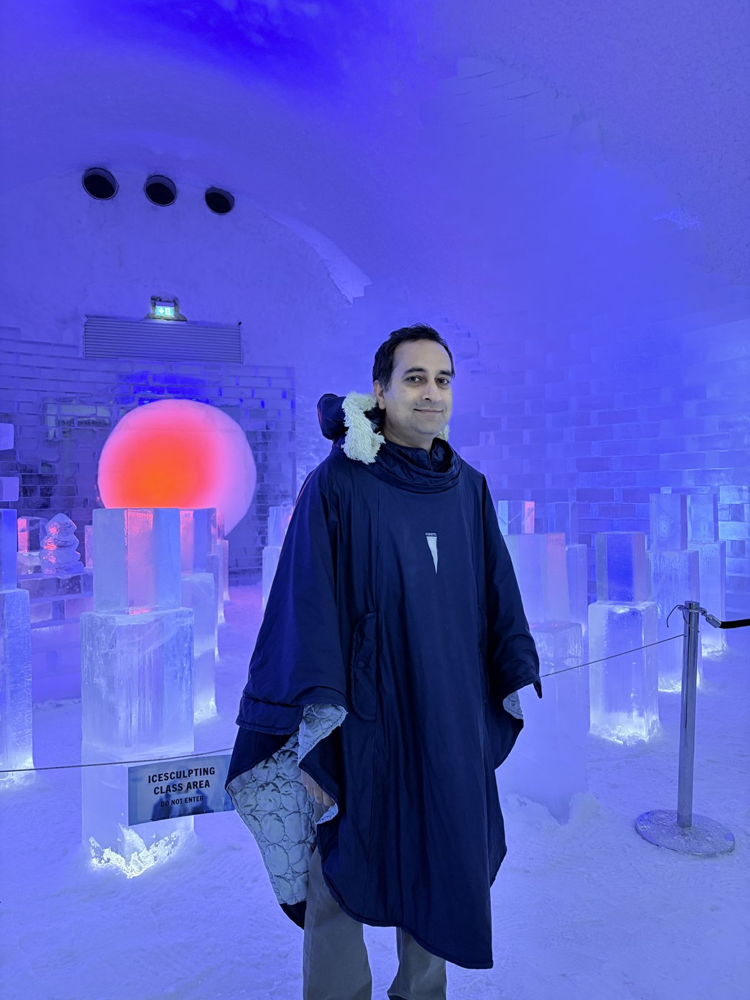
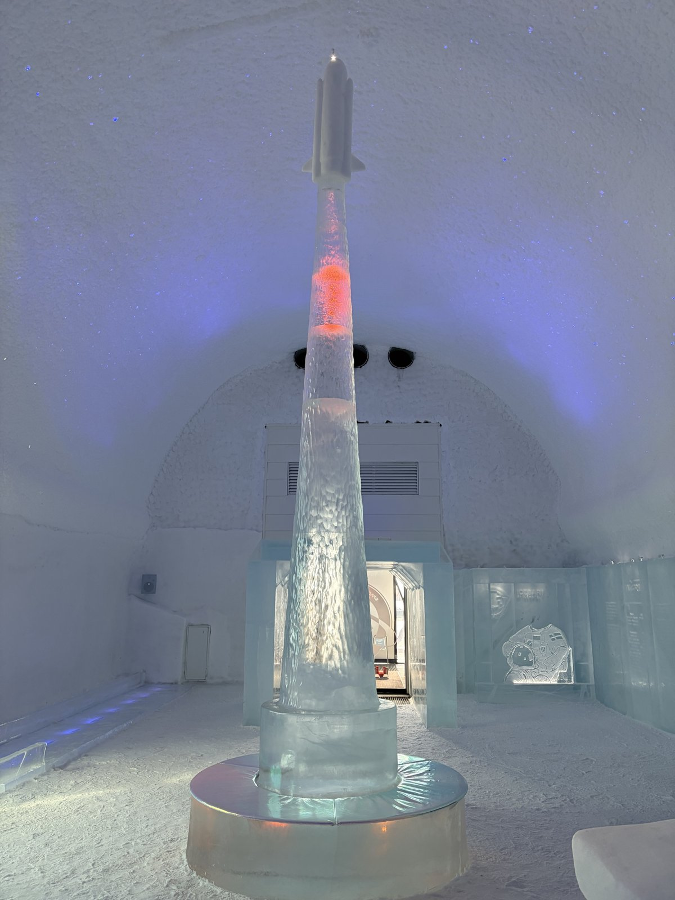
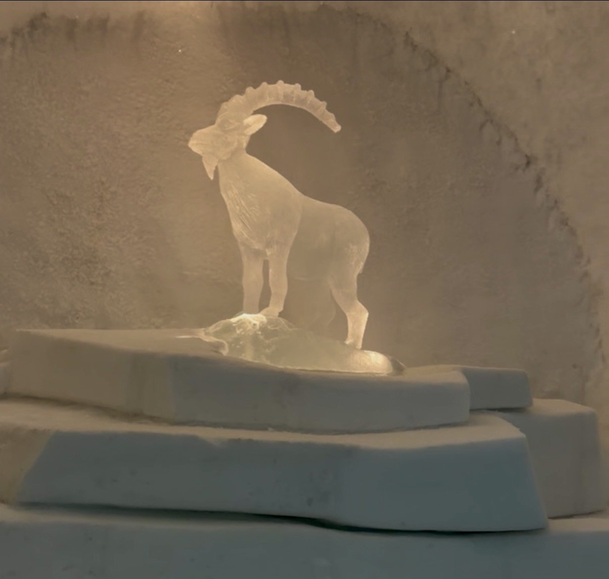
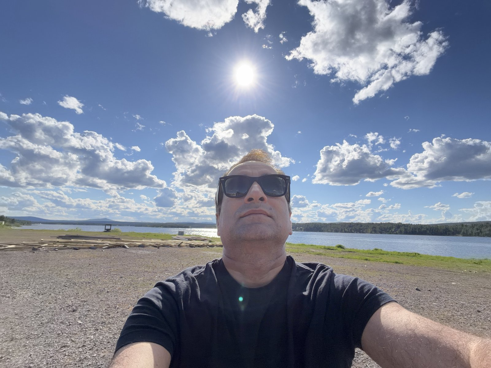
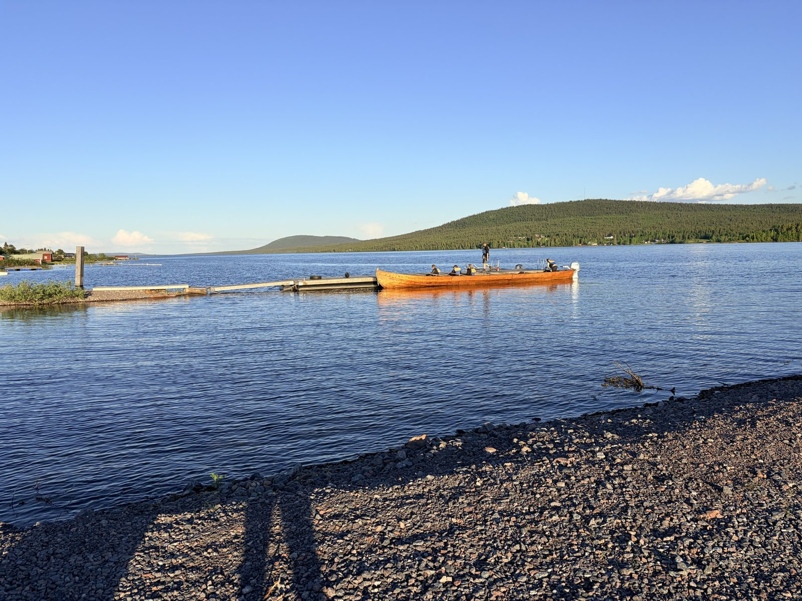

Title: Near-Mine Risk Assessment and the Midnight Sun
Date: 2026-07-03
Summary: Fieldwork in Swedish Lapland, with a night at the Icehotel and a swim in the Torne River under the midnight sun.
Cover: images/midnight-sun-river.jpeg

This summer's fieldwork took me to Swedish Lapland, one of the most important mining regions in Europe. Alongside the work in the field, there was plenty of time for good discussions with experts and industry partners about the challenges modern mining faces today, from ground stability and monitoring to how new sensing technologies can support safer operations. Conversations like these, held on site rather than in a meeting room, are often where the most useful ideas come from.

  
  

  
  

The setting made the trip unforgettable. I stayed at the Icehotel, where the rooms, walls and even the art are carved from ice taken from the river each winter. It is a strange and beautiful experience to sleep in a room that will melt away and be rebuilt again next year.

  
  
  

Then there was the light. Up here, in summer, the sun forgets how to set. It sinks toward the horizon in the evening, hesitates there as if deciding, and then slowly begins to climb again. The hours lose their edges. Ten in the evening feels like late afternoon, midnight feels like a long golden dawn, and after a day or two you stop checking the clock altogether. The Finns have a beautiful name for it, *yötön yö*, the nightless night.

  
  

One evening, close to midnight, I went for a swim in the Torne River. The water was cool and clear, and the river moved so slowly that its surface lay almost like glass, holding a perfect copy of the sky and the forest along its banks. I swam slowly, in no hurry to reach anywhere. The low sun stretched a soft gold path across the water, and everything was completely silent. Floating there in full daylight, at an hour that should have been dark, it felt less like being in a place and more like being outside of time for a while.

A rewarding trip, in the field and far beyond it.

<video controls playsinline muted preload="metadata" poster="../../images/icehotel-walkthrough-poster.jpeg" style="display: block; width: 100%; max-width: 420px; margin: 0 auto; border-radius: 6px;">
  <source src="../../images/icehotel-walkthrough.mp4" type="video/mp4">
</video>

