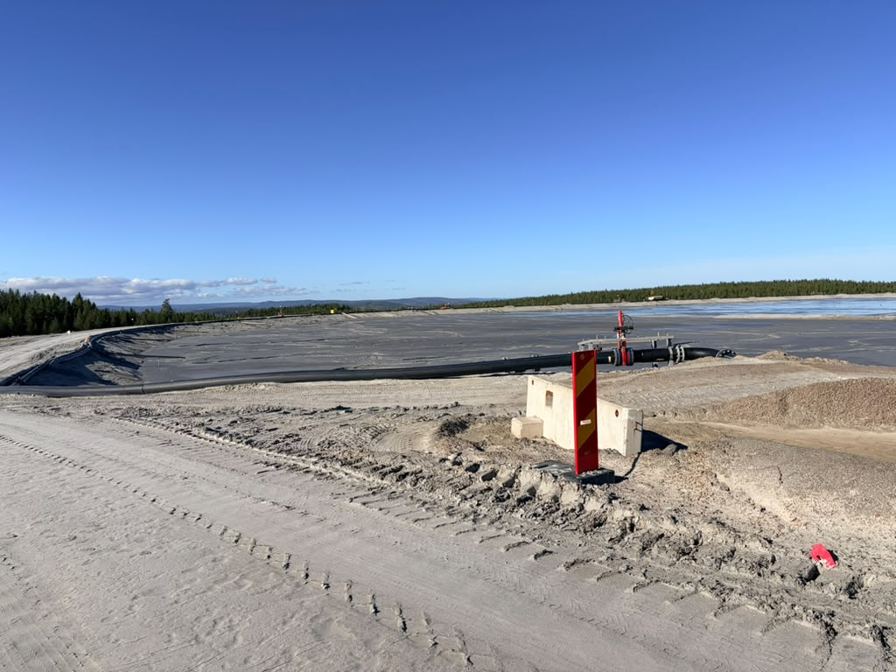
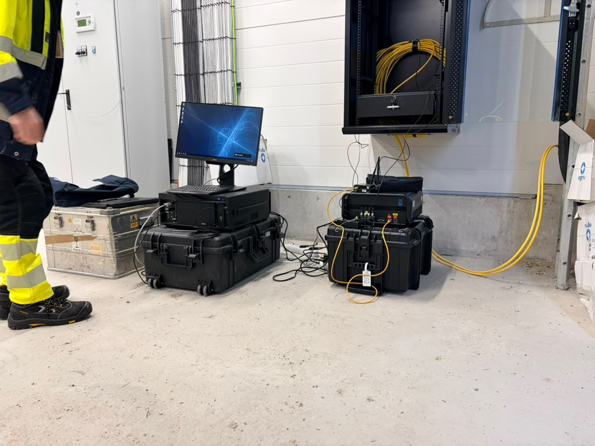
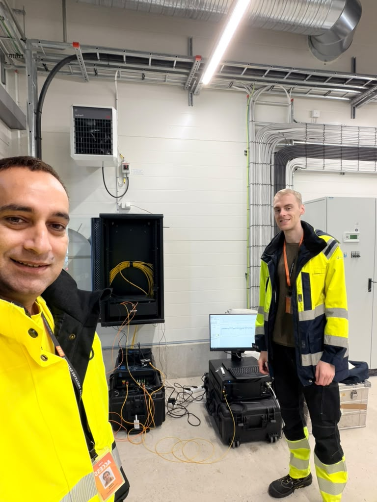

Title: Light Through the Tailings, Gold Through the Trees
Date: 2026-09-29
Summary: Autumn fieldwork in Sweden comes with a bonus: forests turning gold, red and purple against the dark green spruce.
Cover: images/autumn.jpeg

We're excited to share the results of our autumn field deployment: distributed fiber-optic sensing installed on a tailings dam at one of the most modern mines in the world, and one with more than 100 years of history.

Around the world, tailings dams hold back billions of tones of fine, wet mine waste, and many of them must stay stable for decades after mining ends. When they fail, the damage reaches rivers, farmland and the communities downstream. Yet dam deformation is a slow hazard, and it is still monitored mostly from the surface. Surveys and satellites are powerful tools, but they show how the surface moves, not what is happening inside the embankment.

Our goal is to measure it directly. We installed fiber-optic cable in the dam and measured it with distributed strain sensing (DSS), turning a single cable into thousands of sensors along its length. Light sent through the fiber shows where the embankment is stretching or compressing, and how that strain evolves over time. A steady increase in one section can be an early warning of movement, well before it shows at the surface. To separate real ground movement from seasonal warming and cooling, we ran distributed temperature sensing (DTS) on the same cables and used it to correct the strain data.

The aim is ground-truth subsurface data that complements existing monitoring and feeds into decision support for the people responsible for these structures: dam operators, mine planners, regulators, and the communities and ecosystems downstream.

I am grateful to our co-worker, whose skill and good humor made every long day in the field easy and enjoyable.

And the setting helped too. Swedish autumn turned the forests around the site gold, red and purple against the dark green spruce.

Great field days, great data.

\#DTS #DSS #FibreOpticSensing #TailingsDam #MineSafety #Geophysics #Sweden

